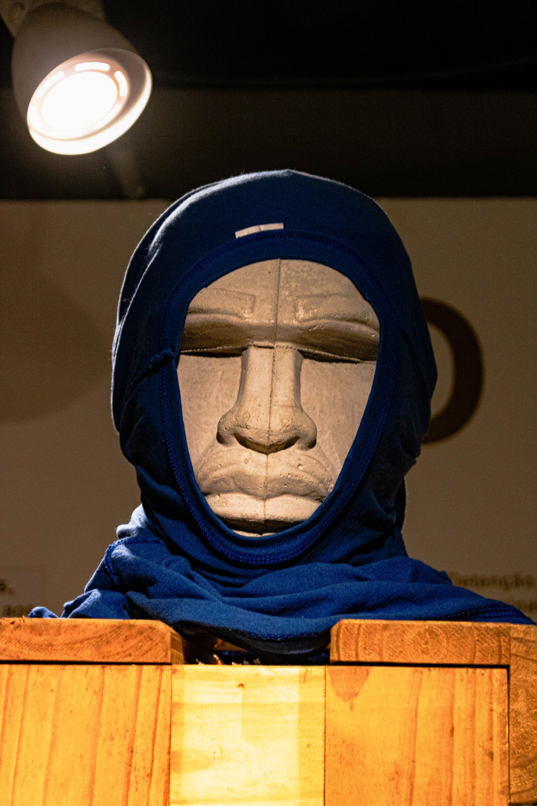
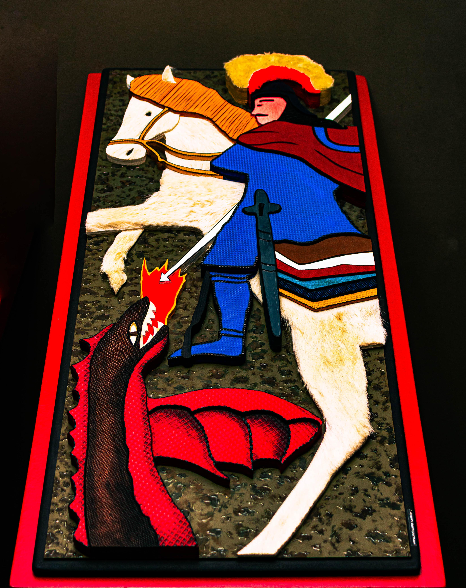
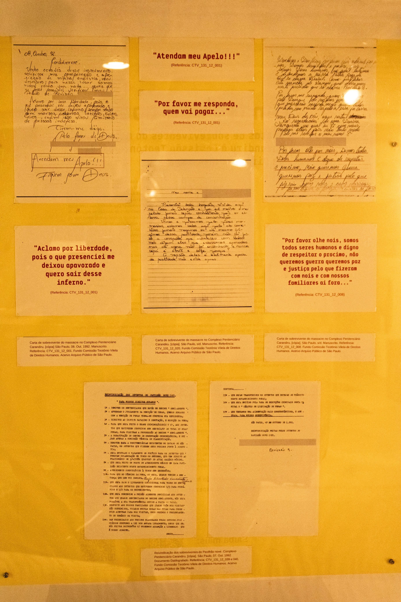
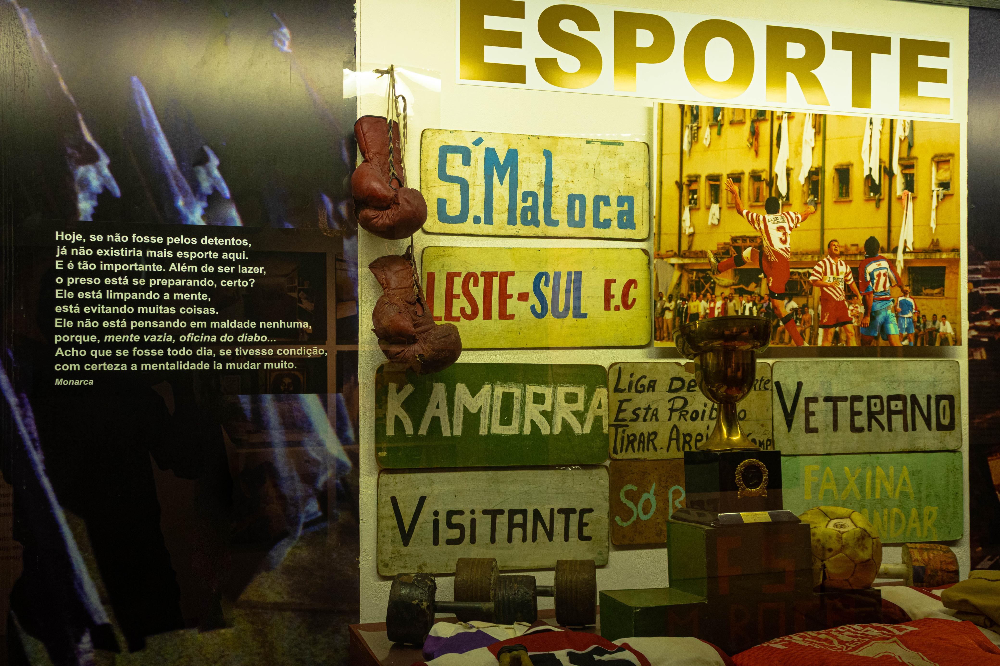
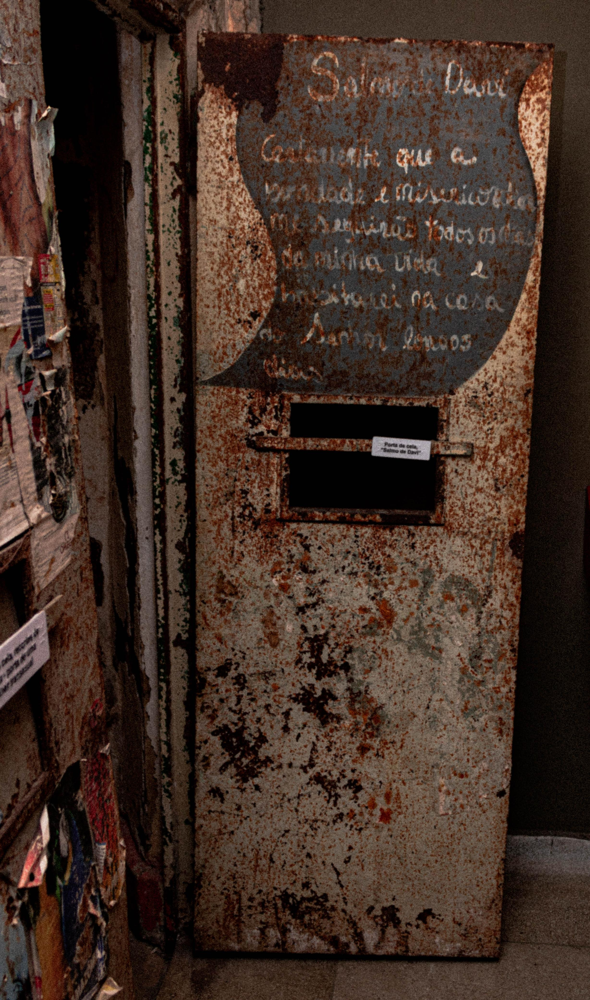
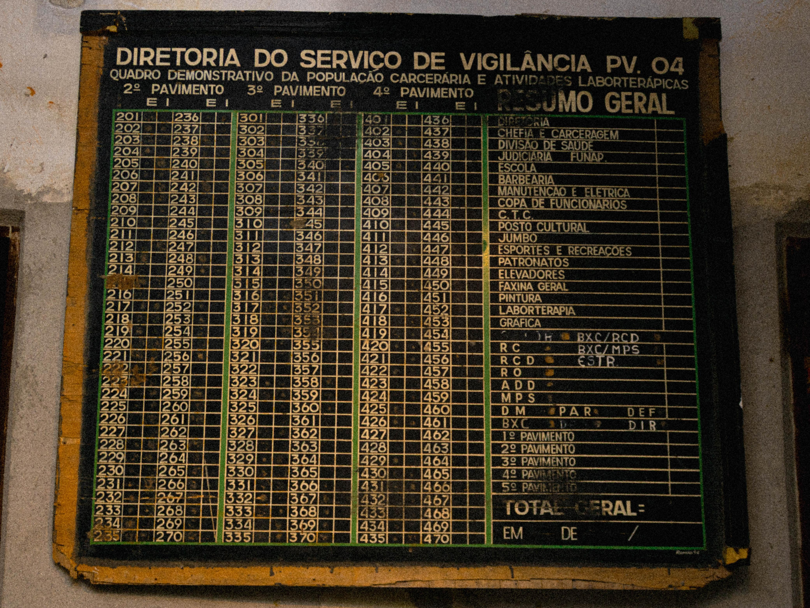
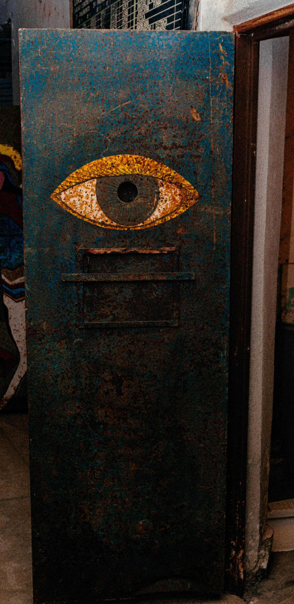

  <!-- HERO -->
  <section class="hero">
    

    

      

      <h1>Um lugar de <em>história</em>, <em>reflexão</em> e memória</h1>
      
O Memorial Carandiru preserva a história do Complexo
        Penitenciário do Carandiru e dos eventos de 2 de outubro
        de 1992, promovendo o debate sobre o sistema prisional,
        os direitos humanos e a transformação social no Brasil.
      

      

        <a href="#visitar" class="btn-principal">Visitar o espaço</a>
      

      
<!-- /.hero-content-inner -->
    

    
Rolar

  </section>

 <!-- LINHA DO TEMPO -->
  <section class="secao" id="historia">
    

      <h2 class="secao-titulo">Linha do tempo histórica</h2>
      <a href="carandiru-pagina2.html" class="ver-mais">Ver história completa →</a>
    

    

      

        <a class="evento ativo" href="carandiru-pagina2.html?ev=1833"
          onclick="ativarEvento(this,'1833','As Primeiras Raízes e a Antiga Cadeia','A história das unidades de reclusão em São Paulo começou a tomar forma com estruturas mais antigas na cidade, servindo como embrião para o planejamento de um sistema prisional centralizado que futuramente daria origem ao Carandiru.');return false;">
          
1833

          <h3>Origens</h3>
          
O início da organização do sistema prisional na capital paulista

        </a>

        <a class="evento" href="carandiru-pagina2.html?ev=1904"
          onclick="ativarEvento(this,'1904','O Concurso de Arquitetura e Planejamento','Para acompanhar o crescimento urbano da cidade, o governo promoveu um concurso para projetar um espaço moderno e adequado para a época, buscando trazer preceitos de higiene e organização para a zona norte.');return false;">
          
1904

          <h3>Planejamento</h3>
          
O projeto arquitetônico para uma nova penitenciária

        </a>

        <a class="evento" href="carandiru-pagina2.html?ev=1920"
          onclick="ativarEvento(this,'1920','A Inauguração e o Modelo de Época','O complexo abriu suas portas com foco em preceitos científicos e sanitários defendidos por especialistas da época, buscando ser um marco de modernidade e reforma social.');return false;">
          
1920

          <h3>Inauguração</h3>
          
Abertura do complexo com foco em padrões modernos

        </a>

        <a class="evento" href="carandiru-pagina2.html?ev=1956"
          onclick="ativarEvento(this,'1956','Crescimento e Novos Pavilhões','O complexo passou por ampliações estruturais para absorver a demanda da capital, recebendo novos pavilhões e homenageando figuras da medicina legal paulista.');return false;">
          
1956

          <h3>Expansão</h3>
          
Entrega de novos pavilhões e aprofundamento estrutural

        </a>

        <a class="evento" href="carandiru-pagina2.html?ev=1978"
          onclick="ativarEvento(this,'1978','Desafios de Lotação e Debates Públicos','Com o aumento constante da população urbana e carcerária, os desafios estruturais se intensificaram, gerando debates na sociedade sobre os rumos do sistema penal.');return false;">
          
1978

          <h3>Desafios</h3>
          
Crescimento da população e discussões sobre o sistema

        </a>
        
        <a class="evento" href="carandiru-pagina2.html?ev=1992"
          onclick="ativarEvento(this,'1992','Um Marco de Transformação e Direitos Humanos','O doloroso episódio no Pavilhão 9 transformou-se em uma cicatriz profunda na história de São Paulo, impulsionando discussões essenciais e urgentes sobre direitos humanos, justiça e cidadania no país.');return false;">
          
1992

          <h3>Reflexão</h3>
          
O fatídico evento no Pavilhão 9 e o debate nacional

        </a>

        <a class="evento" href="carandiru-pagina2.html?ev=2002"
          onclick="ativarEvento(this,'2002','A Desativação e a Chegada do Parque','O encerramento das atividades do complexo encerrou um ciclo difícil, abrindo caminho para a demolição dos prédios e a devolução daquela grande área para a comunidade.');return false;">
          
2002

          <h3>Renovação</h3>
          
Desativação dos pavilhões e o nascimento do Parque

        </a>

        <a class="evento" href="carandiru-pagina2.html?ev=hoje"
          onclick="ativarEvento(this,'Hoje','O Espaço Memorial e a Preservação da Memória','Hoje, o Espaço Memorial atua como um local de preservação histórica, salvando documentos, relatos e imagens para educar as novas gerações na construção de uma sociedade mais justa e acolhedora.');return false;">
          
Hoje

          <h3>Memória</h3>
          
Atuação do Espaço Memorial na educação e cidadania

        </a>
      

      

        
1920

        

          
Abertura do Complexo com Foco em Padrões Modernos

          
O complexo abriu suas portas com foco em preceitos científicos e sanitários defendidos por especialistas da época, buscando ser um marco de modernidade e reforma social para a cidade de São Paulo.

          <a href="carandiru-pagina2.html" class="td-link" id="td-link">Ler mais sobre este período →</a>
        

      

    

  </section>

  <!-- EDITORIAL -->
  

    

    

      
Em destaque

      <h2>O Massacre de 1992 e a busca por justiça</h2>
      
O episódio de 2 de outubro de 1992 permanece como um dos momentos mais sombrios da história penal brasileira.
        Mais de três décadas depois, famílias das vítimas ainda aguardam respostas e reparações. O Espaço Memória
        preserva depoimentos, documentos e objetos que contam essa história sob a perspectiva de quem a viveu.

      
Explore nossa coleção de documentos originais, fotografias de época e testemunhos que compõem o acervo do
        Memorial.

      <a href="carandiru-pagina2.html">Ver acervo completo →</a>
    

  

<section class="galeria-acervo" id="galeria">
  

    <h2>Nosso <em>acervo</em></h2>
    
Confira fotos e registros do acervo do Memorial do Carandiru.

    Registros por Vinícius Santos (1° EM Marketing 2026 | Etec São Mateus)
  

  

    <button type="button" class="galeria-acervo__item" data-index="0">
      #01
      
      +
    </button>

    <button type="button" class="galeria-acervo__item" data-index="1">
      #02
      
      +
    </button>

    <button type="button" class="galeria-acervo__item" data-index="2">
      #03
      
      +
    </button>

    <button type="button" class="galeria-acervo__item" data-index="3">
      #04
      
      +
    </button>

    <button type="button" class="galeria-acervo__item" data-index="4">
      #05
      
      +
    </button>

    <button type="button" class="galeria-acervo__item" data-index="5">
      #06
      
      +
    </button>

    <button type="button" class="galeria-acervo__item" data-index="6">
      #07
      
      +
    </button>
  

</section>

<!-- Lightbox Modal -->

  

    <button type="button" class="galeria-acervo__fechar" id="galeriaFechar" aria-label="Fechar">&times;</button>
  

  <button type="button" class="galeria-acervo__nav galeria-acervo__nav--anterior" id="galeriaAnterior" aria-label="Foto anterior">&#10094;</button>
  <button type="button" class="galeria-acervo__nav galeria-acervo__nav--proximo" id="galeriaProximo" aria-label="Próxima foto">&#10095;</button>
  <figure class="galeria-acervo__figura">
    
    <figcaption>
      
      

      

      
Registros por Vinícius Santos (1° EM Marketing 2026 | Etec São Mateus)

    </figcaption>
  </figure>

<!-- Lightbox Modal -->

  

    <button type="button" class="galeria-acervo__fechar" id="galeriaFechar" aria-label="Fechar">&times;</button>
  

  <button type="button" class="galeria-acervo__nav galeria-acervo__nav--anterior" id="galeriaAnterior" aria-label="Foto anterior">&#10094;</button>
  <button type="button" class="galeria-acervo__nav galeria-acervo__nav--proximo" id="galeriaProximo" aria-label="Próxima foto">&#10095;</button>
  <figure class="galeria-acervo__figura">
    
    <figcaption>
      
      

      

      
Fotografia por Vinícius Santos(2026)

    </figcaption>
  </figure>

  <!-- ACERVO -->
  <section class="secao" id="acervo">
    

      <h2 class="secao-titulo">Acervo e cultura</h2>
      <a href="carandiru-pagina2.html" class="ver-mais">Ver acervo completo →</a>
    

    

      <a class="acervo-card" href="carandiru-pagina2.html?item=documentos">
        

          <svg viewBox="0 0 24 24" fill="none" stroke="currentColor" stroke-width="1.5">
            <path
              d="M9 12h6m-6 4h6m2 5H7a2 2 0 01-2-2V5a2 2 0 012-2h5.586a1 1 0 01.707.293l5.414 5.414a1 1 0 01.293.707V19a2 2 0 01-2 2z" />
          </svg>
          Documentos
        

        

          
Arquivo histórico

          <h3>Documentos e registros oficiais</h3>
        

      </a>
      <a class="acervo-card" href="carandiru-pagina2.html?item=fotografias">
        

          <svg viewBox="0 0 24 24" fill="none" stroke="currentColor" stroke-width="1.5">
            <path
              d="M3 9a2 2 0 012-2h.93a2 2 0 001.664-.89l.812-1.22A2 2 0 0110.07 4h3.86a2 2 0 011.664.89l.812 1.22A2 2 0 0018.07 7H19a2 2 0 012 2v9a2 2 0 01-2 2H5a2 2 0 01-2-2V9z" />
            <circle cx="12" cy="13" r="3" />
          </svg>
          Fotografias
        

        

          
Fotografia

          <h3>Fotografias históricas do complexo</h3>
        

      </a>
      <a class="acervo-card" href="carandiru-pagina2.html?item=depoimentos">
        

          <svg viewBox="0 0 24 24" fill="none" stroke="currentColor" stroke-width="1.5">
            <path
              d="M8 12h.01M12 12h.01M16 12h.01M21 12c0 4.418-4.03 8-9 8a9.863 9.863 0 01-4.255-.949L3 20l1.395-3.72C3.512 15.042 3 13.574 3 12c0-4.418 4.03-8 9-8s9 3.582 9 8z" />
          </svg>
          Depoimentos
        

        

          
Memória oral

          <h3>Depoimentos de sobreviventes e famílias</h3>
        

      </a>
      <a class="acervo-card" href="carandiru-pagina2.html?item=arte">
        

          <svg viewBox="0 0 24 24" fill="none" stroke="currentColor" stroke-width="1.5">
            <path
              d="M4 16l4.586-4.586a2 2 0 012.828 0L16 16m-2-2l1.586-1.586a2 2 0 012.828 0L20 14m-6-6h.01M6 20h12a2 2 0 002-2V6a2 2 0 00-2-2H6a2 2 0 00-2 2v12a2 2 0 002 2z" />
          </svg>
          Arte e cultura
        

        

          
Expressão artística

          <h3>Arte produzida por detentos</h3>
        

      </a>
    

  </section>

  <!-- VISITAR -->
  <section class="visitar" id="visitar">
    

      

        <h2>Visite o Espaço Memória</h2>
        
O memorial está aberto ao público e oferece visitas guiadas, exposições permanentes e temporárias, atividades
          educativas e eventos culturais. A entrada é gratuita.

        <a href="#" class="btn-principal" style="font-size:12px;">Agendar visita guiada</a>

        

          

            
Endereço

            
Av. Cruzeiro do Sul, 2630 Santana, São Paulo – SP

          

          

            
Funcionamento

            
Terça a domingo 09h às 17h

          

          

            
Entrada

            
Gratuita Grupos: agendamento

          

          

            
Transporte

            
Metrô Carandiru Linha 1 – Azul

          

        

      

      

        <svg viewBox="0 0 24 24" fill="none" stroke="currentColor" stroke-width="1.5">
          <path d="M17.657 16.657L13.414 20.9a1.998 1.998 0 01-2.827 0l-4.244-4.243a8 8 0 1111.314 0z" />
          <path d="M15 11a3 3 0 11-6 0 3 3 0 016 0z" />
        </svg>
        Ver no mapa
        Av. Cruzeiro do Sul, 2630
      

    
<!-- /.visitar-inner -->
  </section>

